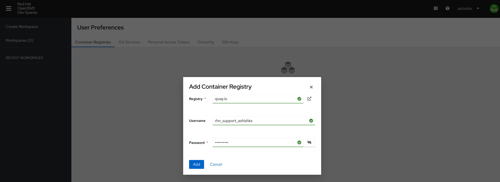

## Development using devspace 

- Access the devspace url (FIXME: url link)

- Click on `Log in with OpenShift` button.

- Click on `my_htpasswd_provider` option.

- On the next screen, provide your Username and Password for login.

- On the `Authorize Access` page, under `Requested permissions`, mae sure `user:full` option is selected (ticked) and click on `Allow selected permissions` button.

- Configure your `quay.io` credentials on the OpenShift Dev Spaces portal.

- Click your username on top right and click on `User Preferences` option.

- On the `User Preferences` screen under `Container Registries` tab, click on `Add Container Registry` option.

- On the Add Container Registry pop-up provide details as below and the click on `Add` Button.

**Registry:** *quay.io*  
**Username:** *your quay.io login*  
**Password:** *your quai.io login* password  

- Click on `Create Workspace` option on left pane.
Under `Import from Git section, provide the Git repo URL for your training and click on `Create & Open` button.

NOTE: Make sure you have initialized your training content repository and committed the changes before using it in the devspace.

- Click on the search bar for Workspace on top and click on `Run Task` option, then click `devfile`.

- Click on `0-install` option and wait for it to finish.

- Repeat the earlier step to select devfile and click on `1-watch` option this time.

- Repeat the same steps and select `2-serve` option now.

- Pop-up will be displayed at the bottom of the screen.

- Create `Open In New Tab` button.

- On the next pop-up message: `Do you want VS Code - Open Source to open the external website?` click on `Open` button.

- Rendered content will now be displayed in another tab.

- You may continue with your content development in the `vscode` interface provided by devspace.

- When you save your changes in the content files in devspace interface, the changes will be reflected in the rendered content url as soon as you refresh the url.

FIXME: highlight the relevant area on images.

**SEE ALSO**

- [Getting started with a new training content repository](./README.md)
- [Guideline for editing your content](./USAGE.md)
